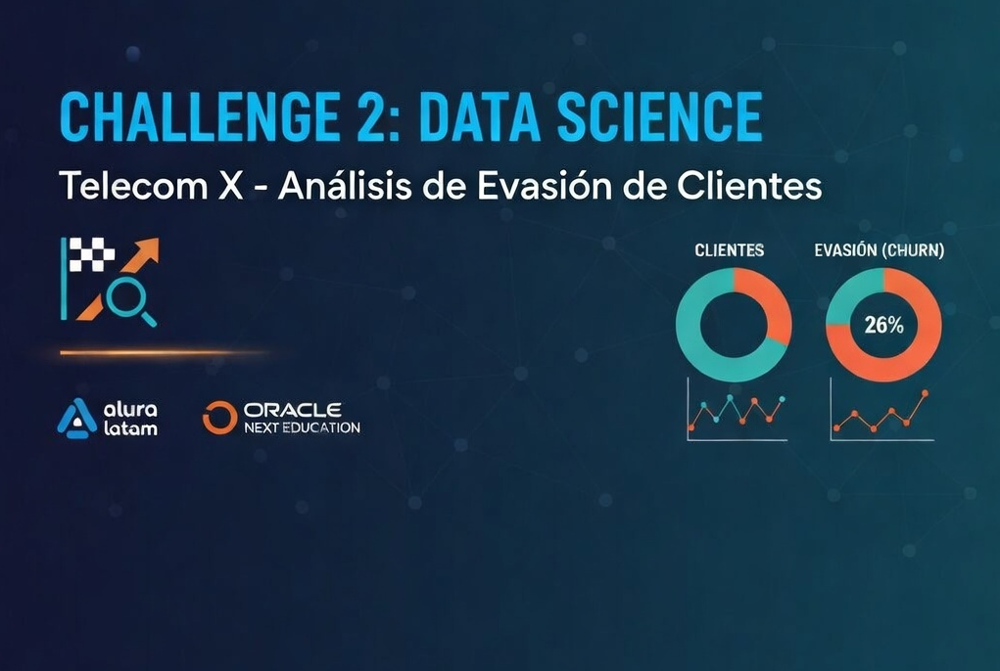

<div align="center">

<!-- Banner principal -->


<br/>

# 📡 TelecomX — Análisis de Evasión de Clientes

### *Challenge 2 · Data Science · Alura Latam + Oracle Next Education*

<br/>

<!-- Banner Alura -->


<br/>

[](https://www.python.org/)
[](https://pandas.pydata.org/)
[](https://jupyter.org/)
[](https://colab.research.google.com/)
[](https://github.com/badolgm/ChallengeTELECOM-X/blob/main/LICENSE)
[](https://github.com/badolgm/ChallengeTELECOM-X)

</div>

---

## 📌 Tabla de Contenidos

1. [Sobre el Proyecto](#sec-sobre)
2. [El Problema de Negocio](#sec-problema)
3. [Metodología ETL](#sec-metodologia)
4. [Resultados del Análisis](#sec-resultados)
5. [Conclusiones e Insights](#sec-conclusiones)
6. [Recomendaciones Estratégicas](#sec-recomendaciones)
7. [Estructura del Repositorio](#sec-estructura)
8. [Tecnologías Utilizadas](#sec-tecnologias)
9. [Instalación y Uso](#sec-instalacion)
10. [Autor](#sec-autor)

---

<a id="sec-sobre"></a>

## 📝 Sobre el Proyecto

> **Telecom X** enfrenta una tasa crítica de **evasión de clientes (Churn) del 26%**, lo que representa una pérdida significativa de ingresos recurrentes.

Este proyecto forma parte del **Challenge 2 de Data Science** del programa **ONE (Oracle Next Education)** en alianza con **Alura Latam**. Como analista de datos, el objetivo fue transformar datos crudos de la API oficial en inteligencia accionable para que el equipo de Ciencia de Datos pueda construir modelos predictivos de churn.

<div align="center">

| 📊 Dataset | 🔗 Fuente | 📁 Formato | 👥 Registros |
|:---:|:---:|:---:|:---:|
| TelecomX Customers | API pública GitHub | JSON anidado | 7.043 clientes |

</div>

---

<a id="sec-problema"></a>

## 💡 El Problema de Negocio

```
¿Por qué los clientes abandonan Telecom X?
     │
     ├─► Tipo de contrato (Mes a Mes vs Anual)
     ├─► Método de pago utilizado
     ├─► Tiempo de permanencia (tenure)
     ├─► Nivel de cargos mensuales
     └─► Servicios contratados
```

---

<a id="sec-metodologia"></a>

## 🏗️ Metodología ETL

El proyecto sigue una arquitectura **ETL** dividida en 3 fases:

---

### ⚙️ Fase 1 — Extracción (Extract)

Carga del dataset desde la API pública del challenge mediante `requests` y normalización de la estructura JSON anidada con `pd.json_normalize()`.

```python
url = "https://raw.githubusercontent.com/ingridcristh/challenge2-data-science-LATAM/main/TelecomX_Data.json"
df = pd.json_normalize(requests.get(url).json())
```

---

### 🔧 Fase 2 — Transformación (Transform)

| Tarea | Descripción |
|-------|-------------|
| 🔍 Exploración | Inspección de tipos, nulos y duplicados |
| 🧹 Limpieza | Conversión de `Charges.Total` y `Charges.Monthly` a numérico; relleno de nulos con `0` para clientes sin historial |
| 🏷️ Estandarización | Traducción de 21 columnas al español |
| ⚙️ Feature Engineering | Creación de `Cuentas_Diarias` = `Cargos_Mensuales / 30` |
| 🔢 Encoding | Conversión de `Churn` Yes/No → binario 1/0 |

---

### 📊 Fase 3 — Carga y Análisis (Load & Analysis)

Análisis exploratorio completo con estadísticas descriptivas, visualizaciones de distribución y matriz de correlación.

> 📊 **¿Quieres ver los gráficos?** Están disponibles en el notebook interactivo:
> **[▶️ Abrir en Google Colab](https://colab.research.google.com/github/badolgm/ChallengeTELECOM-X/blob/main/TelecomX_LATAM.ipynb)**

---

<a id="sec-resultados"></a>

## 📊 Resultados del Análisis

### Hallazgo 1 — Tasa de Evasión General

De los **7.043 clientes** analizados, aproximadamente **1 de cada 4 abandona el servicio**, con una tasa de churn del **~26%**. Esta cifra es crítica para el negocio y justifica la implementación urgente de estrategias de retención.

---

### Hallazgo 2 — Tipo de Contrato

El tipo de contrato es el factor más determinante en la evasión:

| Tipo de Contrato | Perfil de Riesgo |
|---|---|
| **Mes a Mes** | ⚠️ Riesgo alto — concentra la mayoría de los clientes que evaden |
| **Un año** | ✅ Riesgo moderado — tasa de evasión significativamente menor |
| **Dos años** | ✅ Riesgo bajo — la tasa de evasión es mínima |

Los clientes sin compromiso de permanencia son los más vulnerables a abandonar el servicio.

---

### Hallazgo 3 — Tiempo de Permanencia (Tenure)

Existe una **correlación negativa** clara entre los meses de contrato y la evasión: los clientes que evaden llevan en promedio muchos menos meses con la empresa que los que permanecen. Los clientes con **menos de 6 meses** representan el segmento de mayor riesgo.

---

### Hallazgo 4 — Cargos Mensuales

Los clientes que evaden tienden a pagar **cargos mensuales más altos** que los que se quedan. Esto sugiere que el precio percibido como elevado, especialmente sin un contrato de largo plazo que lo justifique, es un factor de riesgo relevante.

---

### Hallazgo 5 — Método de Pago

| Método de Pago | Perfil de Riesgo |
|---|---|
| **Cheque electrónico** | ⚠️ Riesgo alto — mayor concentración de evasión |
| **Cheque por correo** | 🟡 Riesgo moderado |
| **Transferencia bancaria automática** | ✅ Riesgo bajo |
| **Tarjeta de crédito automática** | ✅ Riesgo bajo |

Los métodos de pago automáticos (domiciliados) están asociados a menor evasión, posiblemente porque generan mayor compromiso y menor fricción en la relación con el servicio.

---

### Hallazgo 6 — Género

El género del cliente **no es un predictor relevante** de evasión. La distribución de churn entre hombres y mujeres es prácticamente idéntica, por lo que no debe ser considerado como variable discriminante en un modelo predictivo.

---

### Resumen de Correlaciones con Evasión

| Variable | Dirección | Fuerza |
|---|---|---|
| Tipo de contrato (mes a mes) | Positiva | Alta |
| Meses de contrato (tenure) | Negativa | Alta |
| Cargos mensuales | Positiva | Moderada |
| Método de pago (cheque electrónico) | Positiva | Moderada |
| Género | — | Sin relevancia |

---

<a id="sec-conclusiones"></a>

## 🔍 Conclusiones e Insights

El análisis muestra que la evasión en Telecom X **no es aleatoria**: responde a patrones claros y predecibles. Los clientes de mayor riesgo comparten un perfil definido: **contrato mes a mes, poco tiempo con la empresa, cargos mensuales elevados y pago mediante cheque electrónico**. Identificar a tiempo a estos clientes permite actuar antes de que decidan irse.

La combinación de estas variables constituye una base sólida para que el equipo de Data Science construya un **modelo de clasificación de churn** con alta capacidad predictiva.

---

<a id="sec-recomendaciones"></a>

## 🎯 Recomendaciones Estratégicas

**1. Migración de contratos mensuales a anuales**
Diseñar incentivos concretos (descuentos, meses gratis, mejoras de plan) para que los clientes con contrato mes a mes migren a compromisos anuales o bianuales. Este es el cambio con mayor impacto potencial.

**2. Programa de alerta temprana**
Crear un sistema de monitoreo para clientes con menos de 6 meses de permanencia, ya que es el período de mayor riesgo de abandono.

**3. Incentivo al pago automático**
Ofrecer un beneficio tangible (descuento o mes bonificado) a clientes que migren del cheque electrónico a débito automático o tarjeta. Reduce la fricción y el riesgo de abandono.

**4. Revisión de propuesta de valor en planes premium**
Analizar si los planes con cargos mensuales más altos ofrecen valor percibido suficiente. Si no, ajustar la propuesta o crear bundles más competitivos.

**5. Modelo predictivo de churn**
Con las variables identificadas — `Tipo_Contrato`, `Meses_Contrato`, `Cargos_Mensuales` y `Metodo_Pago` — el equipo de Data Science cuenta con los insumos necesarios para construir un clasificador de churn de alta precisión.

---

<a id="sec-estructura"></a>

## 📁 Estructura del Repositorio

```
ChallengeTELECOM-X/
│
├── 📓 TelecomX_LATAM.ipynb
├── 📄 README.md
├── 📄 LICENSE
│
└── 📂 assets/
    ├── 🖼️ banner_alura.svg
    └── 📂 images/
        └── 🖼️ img.png
```

---

<a id="sec-tecnologias"></a>

## 🛠️ Tecnologías Utilizadas

<div align="center">

| Herramienta | Uso |
|:-----------:|:----|
| 🐍 **Python 3.10+** | Lenguaje principal |
| 🐼 **Pandas** | Manipulación y análisis de datos |
| 📊 **Matplotlib** | Visualización estática |
| 🎨 **Seaborn** | Visualización estadística avanzada |
| 🌐 **Requests** | Consumo de API REST |
| ☁️ **Google Colab** | Entorno de ejecución en la nube |
| 🐙 **GitHub** | Control de versiones |

</div>

---

<a id="sec-instalacion"></a>

## 🚀 Instalación y Uso

### Opción A — Google Colab (Recomendado)

1. Abre [Google Colab](https://colab.research.google.com/)
2. Ve a `Archivo → Abrir cuaderno → GitHub`
3. Pega la URL de este repositorio
4. Selecciona `TelecomX_LATAM.ipynb`
5. Ejecuta las celdas en orden ▶️

### Opción B — Local

```bash
# 1. Clonar el repositorio
git clone https://github.com/badolgm/ChallengeTELECOM-X.git
cd ChallengeTELECOM-X

# 2. Instalar dependencias
pip install pandas matplotlib seaborn requests

# 3. Abrir el notebook
jupyter notebook TelecomX_LATAM.ipynb
```

---

<a id="sec-autor"></a>

## 🎓 Autor

<div align="center">

**Bernardo Adolfo Gómez Montoya**

Desarrollado con ❤️ en el marco de **Alura Latam + Oracle Next Education**

[](https://www.aluracursos.com/)
[](https://www.oracle.com/lad/education/oracle-next-education/)

</div>

---

<div align="center">

📄 Este proyecto está bajo la **Licencia MIT** — ver el archivo [LICENSE](https://github.com/badolgm/ChallengeTELECOM-X/blob/main/LICENSE) para más detalles.

</div>
